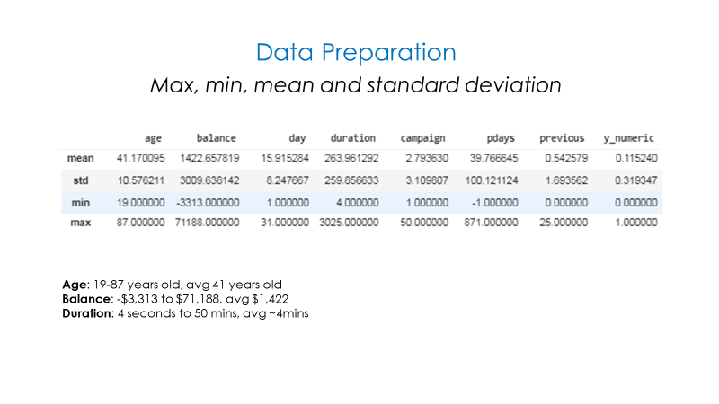
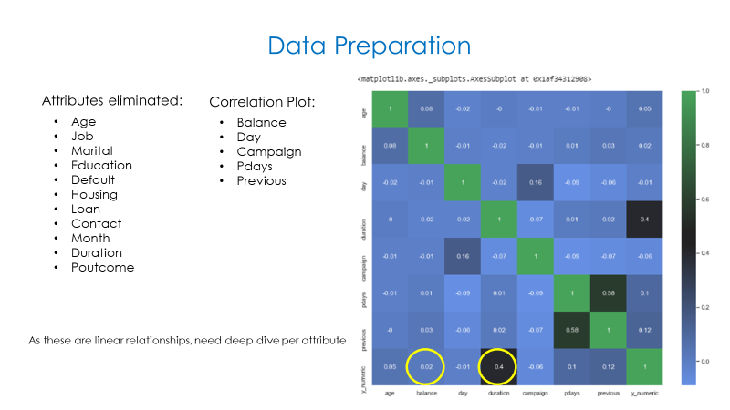
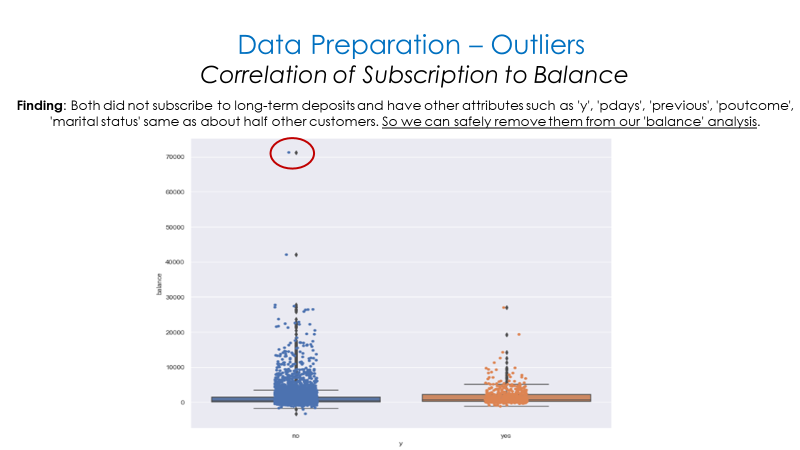
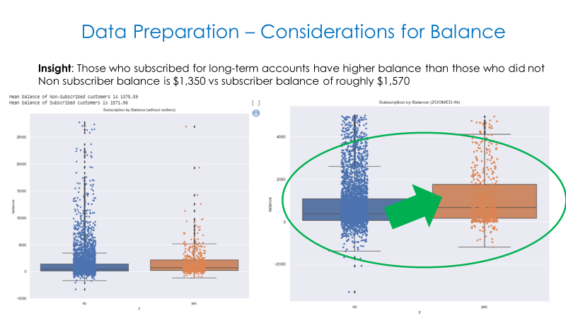
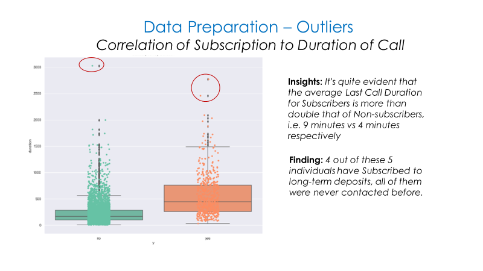
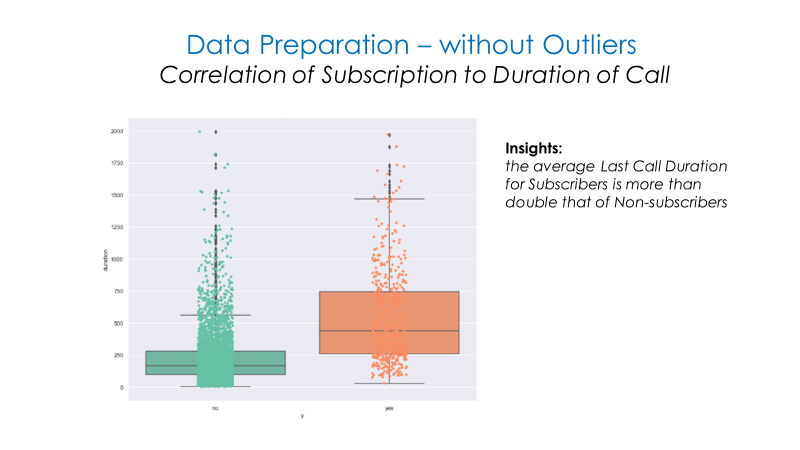
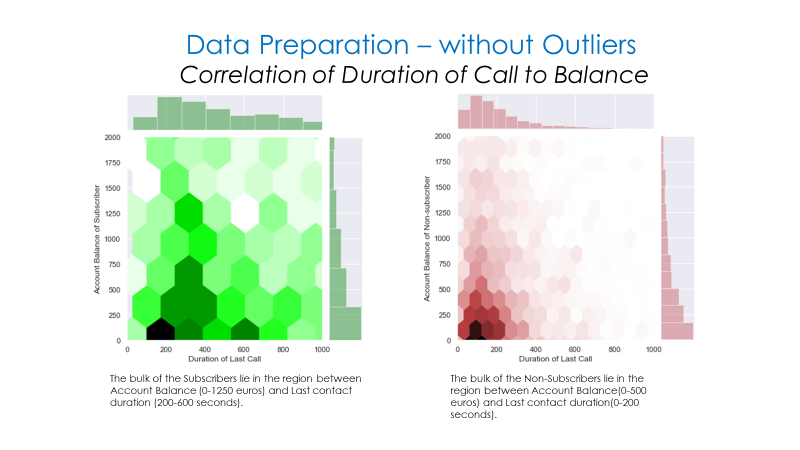
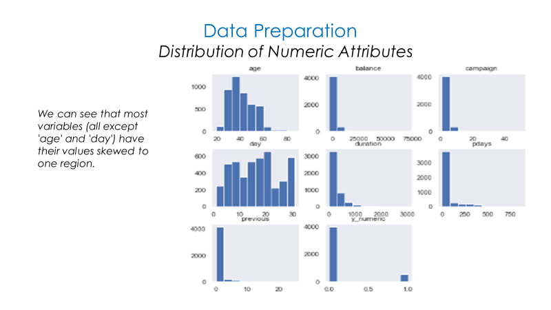
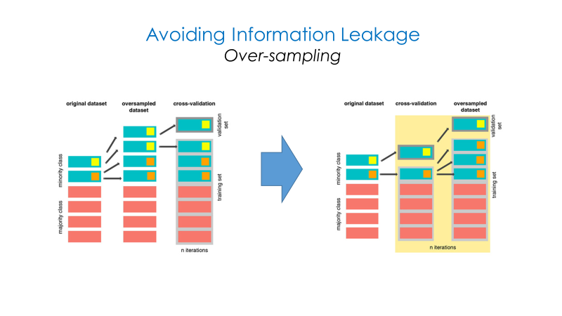
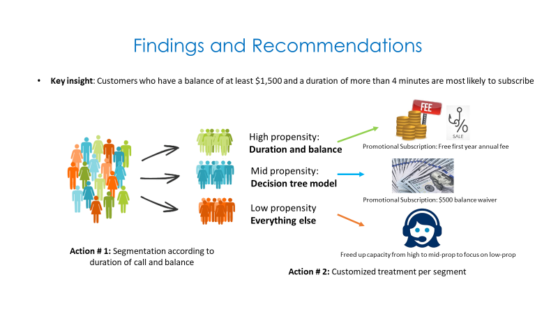

# Bank Marketing Data Hack

### Data Abstract: 
The data is related with direct marketing campaigns of a Portuguese banking institution.
The marketing campaigns were based on phone calls. Often, more than one contact to the same client was required, 
in order to access if the product (bank term deposit) would be ('yes') or not ('no') subscribed.

### Business Objective: 
To predict if the client will subscribe a term deposit (variable y, in the data) or not.

### Meta-Data Description:
Attribute Information:

#### Input variables:
##### Bank client data:
    1 - age (numeric)
    2 - job : type of job (categorical: 'admin.','blue-collar','entrepreneur','housemaid','management','retired','self-employed','services','student','technician','unemployed','unknown')
    3 - marital : marital status (categorical: 'divorced','married','single','unknown'; note: 'divorced' means divorced or widowed)
    4 - education (categorical: 'basic.4y','basic.6y','basic.9y','high.school','illiterate','professional.course','university.degree','unknown')
    5 - default: has credit in default? (categorical: 'no','yes','unknown')
    6 - housing: has housing loan? (categorical: 'no','yes','unknown')
    7 - loan: has personal loan? (categorical: 'no','yes','unknown')
    8 - balance: the current account balance of the customer

##### Data related with the last contact of the current campaign:
    9 - contact: contact communication type (categorical: 'cellular','telephone') 
    10 - month: last contact month of year (categorical: 'jan', 'feb', 'mar', ..., 'nov', 'dec')
    11 - day_of_week: last contact day of the week (categorical: 'mon','tue','wed','thu','fri')
    12 - duration: last contact duration, in seconds (numeric). Important note: this attribute highly affects the output target (e.g., if duration=0 then y='no'). 
         Yet, the duration is not known before a call is performed. Also, after the end of the call y is obviously known. 
         Thus, this input should only be included for benchmark purposes and should be discarded if the intention is to have a realistic predictive model.

##### Miscellaneous attributes:
    13 - campaign: number of contacts performed during this campaign and for this client (numeric, includes last contact)
    14 - pdays: number of days that passed by after the client was last contacted from a previous campaign (numeric; 999 means client was not previously contacted)
    15 - previous: number of contacts performed before this campaign and for this client (numeric)
    16 - poutcome: outcome of the previous marketing campaign (categorical: 'failure','nonexistent','success')

##### Output variable (desired target):
    17 - y - has the client subscribed a term deposit? (binary: 'yes','no')

### Approach to Solution:
This is a typical example of Supervised Learning problem of type Classification. The solution to it is approached in the following broad sequence.
#### Step 1: Exploratory Data Analysis and Data Preparation

#### Step 2: Handling Imbalanced Data set
* This dataset has an Imbalanced Target Class. In the 'y' column, there are 88% observations with label 'no' and only 12% observations with label 'yes'. 
* Machine learning algorithms have trouble learning when one class dominates the other in the target variable. 
* Data needs to be balanced properly
* Two possible methods: 
    1. SMOTE (Synthetic Minority Over-sampling Technique)
    2. ROSE (Random Over-Sampling Examples)
* ROSE seems to give better results

#### Step 3. Predictive Modelling
Four different algorithms were trained on this dataset.
    1. K-Nearest Neighbors
    2. Naive Bayes
    3. Decision Trees
    4. Gradient Boosted Trees 
    
Since the dataset is highly imbalanced on the target variable, ROC-AUC is the primary performance metric.
And as expected, Gradient Boosted Trees performed the best on this metric.

#### Final Step. Recommendations

Source File:
The original dataset can be found on UCI Machine Learning Repository at the below link.
https://archive.ics.uci.edu/ml/datasets/bank+marketing#

